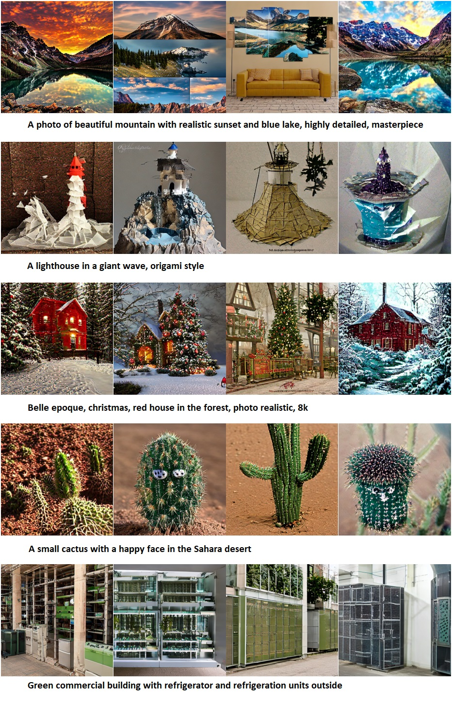

# Consistency-models-T2I-with-diffusion-
In this project we try to accelerate inference for the Stable Diffusion 1.5 "text to image" model. This model can produce beautiful images of a "sad puppy with large eyes" in 50 steps:  

However, generating those takes noticeable time. If we specify just 4 steps, image quality becomes clearly unacceptable:  

We tune the model and end up with very nice results at 4 stepts: 

Our final 4 step model produces nice images for other prompts too:  

SD1.5 consists of the following parts:
1) **VAE** - converts $3{\times}512{\times}512$ images into $4{\times}64{\times}64$ latents and back.
2) **Text encoder** - makes prompt embeddings
3) **Diffusional model** - UNet that generates latents from text embeddings

We demonstrate 3 slightly different approaches to tuning the diffusional model:
1) **Consistency training** - teaching the model to make larger steps along the diffusional denoising trajectory by calculating loss between results (one-step-denoised images) before and after the large step.
2) **Consistency distillation** - same as above, but with using a "teacher" model with classifier-free guidance to make that large step.
3) **Multi-boundary consistency distillation** - same as above, but with results being images denoised to the nearest boundary instead of completely denoised. So here we make same steps as above, but calculate loss at closer points along the denoising trajectory.

We train our models on a part of COCO dataset. We use the following techniques to reduce time and memory usage and fit into free Google Colab and Kaggle GPUs:
1) Low-rank trainable adapters (LoRA) from PEFT library to certrain layers of the initial model while freezing the rest of the model
2) gradient checkpointing
3) gradient accumulation
4) mixed precision approach (we train in FP32 and run inference and "teacher" models in FP16)

This project was created as a part of my training during "CV week" course from Yandex (Школа анализа данных, ШАД).
